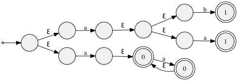
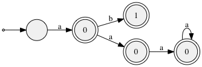
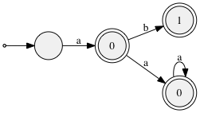
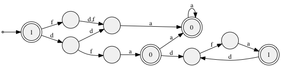

# libfa

C automata library to build, determinize, minimize, translate regexp etc

### Requirements

- GCC or Clang, yacc and lex
- PCRE is used in regression tests to compare matching with PCRE
- graphviz if you want to visualize automatons

### Build

To build run `make`, to run tests `make test`

### Example usage

See [faexample.c](faexample.c) for full example.

```c
// create union NFA of two regexp NFAs
fa_t *a_fa = fa_regexp_fa("^aa*$", &errstr, &errpos, NULL);
// assign 0 to all accepting states for first regexp
fa_set_accepting_opaque(a_fa, (void *)0);
fa_t *b_fa = fa_regexp_fa("^a(a|b)$", &errstr, &errpos, NULL);
// assign 1 to all accepting states for second regexp
fa_set_accepting_opaque(b_fa, (void *)1);
fa_t *union_fa = fa_union(a_fa, b_fa);
fa_graphviz_output(union_fa, "union.dot", NULL);
```

```c
// determinize and choose lowest opaque number when more than one opaque
// value end up in same accepting state.
// this happens when two regexps are overlapping.
fa_t *dfa = fa_determinize_ex(union_fa, state_pri, NULL, NULL);
fa_graphviz_output(dfa, "dfa.dot", NULL);
```

```c
// minimize and treat states with different opaque values as distinguishable.
// this is to be able to know which original regexp has a match when using
// the minimized DFA
fa_t *mdfa = fa_minimize_ex(dfa, state_cmp, NULL);
fa_graphviz_output(mdfa, "mdfa.dot", NULL);
```

```c
// convert minimal DFA into format suitable for running it on input
fa_sim_t *sim = fa_sim_create(mdfa);
fa_sim_run_t fsr;
fa_sim_run_init(sim, &fsr);
if (fa_sim_run(sim, &fsr, (uint8_t *)"aa", 2) == FA_SIM_RUN_ACCEPT)
  printf("matches %p\n", fsr.opaque); // outputs matches 0x0
fa_sim_run_init(sim, &fsr);
if (fa_sim_run(sim, &fsr, (uint8_t *)"ab", 2) == FA_SIM_RUN_ACCEPT)
  printf("matches %p\n", fsr.opaque); // outputs matches 0x1
```
```shell
$ ./faexample
matches 0x0
matches 0x1
```

### Using fatool

Minimal `--min` DFA `--det` that can match regular expression
`^[df]{2}a+$` and `^(dfa)*$` and know which one was matched. First `--in` has
priority.

```shell
./fatool --in 're:^[df]{2}a+$' --in 're:^(dfa)*$' --out dot:- --dfa --min | \
  dot -Gdpi=70 -Tpng -odoc/fatool.png /dev/stdin
```



### Regular expressions

Regular expression syntax tries to be compatible with PCRE with some known
exceptions:

 - No capture groups
 - No back references (not regular)
 - No greediness options (only needed with capture groups?)
 - `[a-^]` or `[^-a]` does not work, use `[a-\^]` instead
 - `(?)` options only support `i`
 - `\x{hhh...}` not supported
 - `\b \B \A \Z \z \G \C \X \p \P` not supported
 - `.` matches any byte
 - `^ab|c$` is matched as `^ab$|c$`

libfa regular expressions have support for matching at bit level using
`(?B<constant>:<bit length>[, ...])` syntax. Constants are matched big-endian
and are limited by the bit length if specified. Max bit length is 32. The sum
of bit lengths must be byte aligned.

The binary syntax support these variants:

- `^(?B32)` or `(?B0x20)` matches a byte of value 32 (bit length defaults to 8)
- `^(?B:4,0xf:4)$` first 4 bit can be anything, last must all be ones.

### Author

Mattias Wadman <mattias.wadman@gmail.com>
